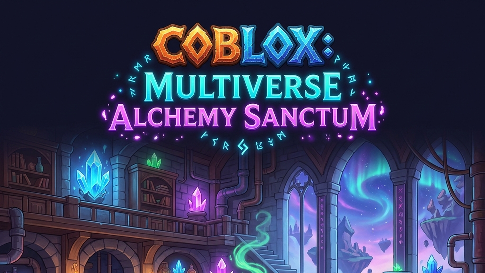

# COBLOX: Multiverse Alchemy Sanctum

<p align="center">
  
</p>

<p align="center">
  <a href="https://www.roblox.com/join/qkced"></a>
  <a href="https://github.com/gpaasdev/COBLOX/actions"></a>
  <a href="https://hycoblox.vercel.app"></a>
  <a href="https://vercel.com/gpaasdev/coblox"></a>
  <a href="https://hycoblox.vercel.app"></a>
  <a href="https://create.roblox.com/docs/cloud"></a>
  <a href="LICENSE"></a>
  <a href="https://luau-lang.org/"></a>
  <br>
  <b>Architecture: Server-Authoritative SOA</b> · <b>79 Services</b> · <b>50 Controllers</b> · <b>21 Shared Configs</b>
</p>

Hybrid Pet Tycoon & Social Action Alkimia di Roblox. Susun Bejana Aura, racik elemen magis dalam matriks 3x3, tetaskan Spirit Companion, dan berkumpul bersama teman dalam klan alkemis (Coven Order).

---

## 📑 Daftar Isi
- [🌟 Fitur Utama & Sistem Terbaru](#-fitur-utama--sistem-terbaru)
- [🛠️ Tech Stack & Ekosistem](#️-tech-stack--ekosistem)
- [🚀 Getting Started](#-getting-started)
- [💻 Penggunaan & Perintah](#-penggunaan--perintah)
- [🧪 Pengujian](#-pengujian)
- [🌐 Publikasi & Web Portal](#-publikasi--web-portal)
- [📄 Lisensi](#-lisensi)

---

## 🌟 Fitur Utama & Sistem Terbaru

- **🏡 Sanctum Grid 3x3:** Tata bejana aura, extractor, dan altar kristal dalam matriks 3x3.
- **🧪 Alchemic Transmutation:** Racik elemen Pyro, Hydro, dan Astral untuk menemukan ramuan rahasia.
- **🐉 Spirit Companions:** Tetaskan telur untuk kawan Spirit dengan mount speed dan auto-harvest.
- **🎵 4-Channel Audio & SoundPool:** Sistem audion yang mendaur ulang instance `Sound` untuk menjaga memori di bawah 2.5 GB.
- **🔗 LaunchData Marketing Engine:** Akses via Roblox Share Link memberikan +250 Aura Energy dan Starter Pack.
- **⭐ Roblox Premium Perks:** Penggandaan +20% Aura Boost & 1.2x Luck Multiplier untuk pelanggan Roblox Premium.
- **📜 Asset License Audit System:** Validator lisensi komersial (CC0, MIT, CustomRoyaltyFree) untuk mencegah klaim DMCA.
- **⚡ Mobile-First Performance:** Beban memori optimal (< 2.5 GB RAM) untuk perangkat mobile low-end.

---

## 🛠️ Tech Stack & Ekosistem

| Komponen | Teknologi / Library | Deskripsi |
| :--- | :--- | :--- |
| **Language & Engine** | Luau `--!strict` / Roblox Engine | Server-Authoritative SOA Architecture |
| **Data Persistence** | ProfileStore v3 | Session Locking murni untuk mencegah duplikasi item |
| **Build & Tooling** | Rojo 7.4.1 + Aftman | Sinkronisasi kode dengan Roblox Studio |
| **Linter & Quality** | Selene 0.27.1 + Python Audit | Penegakan standar RGS Compliance |
| **Cloud Infrastructure** | Roblox OpenCloud APIs | MessagingService & DataStore v2 API |
| **Web Portal & CI/CD** | GitHub Pages + GitHub Actions | Automated Deployment & Multi-Audience Hub |

---

## 🚀 Getting Started

### Prasyarat
- [Aftman](https://github.com/LPGhatguy/aftman) (Toolchain Manager)
- [Rojo 7.4+](https://rojo.space/)
- [Python 3.10+](https://www.python.org/)

### 1. Kloning Repositori
```bash
git clone https://github.com/gpaasdev/COBLOX.git
cd COBLOX
```

### 2. Install Toolchain
```bash
aftman install
```

### 3. Setup Environment Variables
Salin `.env.example` ke `.env` dan isi kunci API Roblox OpenCloud milik Anda.
```bash
cp .env.example .env
```

---

## 💻 Penggunaan & Perintah

### Jalankan Rojo Sync Server (Roblox Studio)
```bash
rojo serve default.project.json
```

### Jalankan Linter Kode Luau
```bash
selene src/
```

### Jalankan Audit Compliance RGS
```bash
python scripts/validate_rgs_compliance.py
```

### Eksekusi OpenCloud Live Broadcast
```bash
python scripts/deploy_opencloud.py
```

---

## 🧪 Pengujian

Semua perubahan kode wajib melewati pengujian sebelum digabung:
```bash
# Validasi kepatuhan arsitektur & dokumentasi
python scripts/validate_rgs_compliance.py

# Validasi linter Luau
selene src/
```

---

## 🌐 Publikasi & Web Portal

- **Portal Utama:** [https://hycoblox.vercel.app](https://hycoblox.vercel.app) (Next.js 16 + Vercel)
- **Admin Dashboard:** `/dashboard` — DataStore viewer, LiveOps broadcast, monitoring, config, CMS
- **Changelog:** `/changelog` — Catatan perubahan setiap rilis
- **Knowledge Base:** `/knowledge-base` — Panduan pemain & referensi
- **Kontak:** `/contact` — Business inquiry & dukungan pemain

---

## 📄 Lisensi

Proyek ini menggunakan [Lisensi MIT](LICENSE). Dibuat untuk komunitas Roblox oleh COBLOX Studio.
