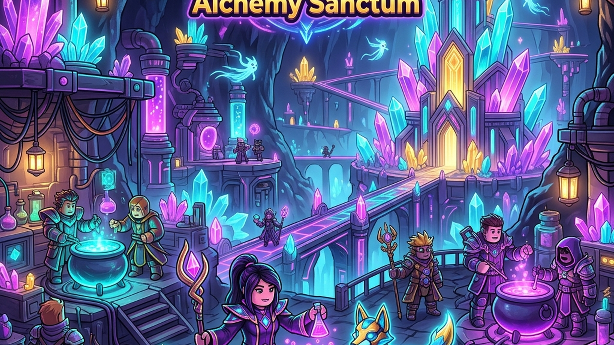

# COBLOX: Multiverse Alchemy Sanctum



[-FF0000?style=for-the-badge&logo=roblox&logoColor=white)](https://www.roblox.com/join/qkced)
[](https://github.com/gpaasdev/COBLOX/actions/workflows/ci.yml)
[](https://gpaasdev.github.io/COBLOX/)
[](LICENSE)
[](https://luau-lang.org/)

Pengalaman **Hybrid Pet Tycoon & Social Action Alkimia** terdepan di Roblox 2026. Susun Bejana Aura otomatis, racik elemen magis dalam matriks 3x3, tetaskan Spirit Companion legendaris, dan berkumpul bersama teman dalam klan alkemis (*Coven Order*).

---

## 🌟 Fitur Utama & Sistem Terbaru

- **🏡 Sanctum Grid 3x3:** Tata bejana aura, extractor otomatis, dan altar kristal secara bebas dalam matriks 3x3 berpresisi tinggi.
- **🧪 Alchemic Transmutation:** Eksperimen racikan elemen Pyro, Hydro, dan Astral untuk menemukan ramuan rahasia dengan bonus *yield multiplier*.
- **🐉 Spirit Companions:** Tetaskan telur magis dengan animasi *spring feedback*, koleksi kawan Spirit imut dengan *mount speed* dan *auto-harvest*.
- **🎵 4-Channel Audio & SoundPool:** Daur ulang `Sound` instances untuk efisiensi RAM (target $<2.5\text{ GB}$) dengan *dynamic BGM crossfading* dan 4 channel (`Master`, `BGM`, `SFX`, `UI`).
- **🔗 LaunchData Marketing Engine:** Integrasi Roblox Share Link ([`https://www.roblox.com/join/qkced`](https://www.roblox.com/join/qkced)) untuk memberikan bonus *+250 Aura Energy* dan *Starter Pack* secara otomatis & aman via `LaunchDataService.luau`.
- **⭐ Roblox Premium Engagement Perks:** Penggandaan otomatis `+20% Aura Boost` & `1.2x Luck Multiplier` untuk pemain berlangganan Roblox Premium via `MonetizationService.luau`.
- **📜 Asset License Audit System:** Validator lisensi komersial runtime (CC0, MIT, CustomRoyaltyFree) via `AssetRegistry.luau` untuk mencegah klaim DMCA.
- **⚡ Mobile-First Performance:** Beban memori dijaga ketat di bawah **< 2.5 GB RAM** untuk pengalaman bebas lag di perangkat mobile low-end.

---

## 🛠️ Tech Stack & Ekosistem

| Komponen | Teknologi / Library | Deskripsi |
| :--- | :--- | :--- |
| **Language & Engine** | Luau `--!strict` / Roblox Engine | Server-Authoritative SOA Architecture |
| **Data Persistence** | ProfileStore v3 | Session Locking murni untuk cegah duplikasi item |
| **Build & Tooling** | Rojo 7.4.1 + Aftman | Synchronizing code dengan Roblox Studio |
| **Linter & Quality** | Selene 0.27.1 + Python Audit | Enforcement standar RGS Compliance |
| **Cloud Infrastructure** | Roblox OpenCloud APIs | MessagingService & DataStore v2 API |
| **Web Portal & CI/CD** | GitHub Pages + GitHub Actions | Automated Deployment & Multi-Audience Hub |

---

## 🚀 Getting Started (Panduan Pengembang)

### Prasyarat
- [Aftman](https://github.com/LPGhatguy/aftman) (Toolchain Manager)
- [Rojo 7.4+](https://rojo.space/)
- [Python 3.10+](https://www.python.org/)

### 1. Kloning Repositori
```bash
git clone https://github.com/gpaasdev/COBLOX.git
cd COBLOX
```

### 2. Install Toolchain
```bash
aftman install
```

### 3. Setup Environment Variables
Salin contoh file `.env.example` ke `.env`:
```bash
cp .env.example .env
```
Isi kunci API Roblox OpenCloud milik Anda pada `.env`.

---

## 💻 Penggunaan & Perintah (Usage Examples)

### Jalankan Rojo Sync Server (Roblox Studio)
```bash
rojo serve default.project.json
```

### Jalankan Linter Kode Luau
```bash
selene src/
```

### Jalankan Audit Compliance RGS
```bash
python scripts/validate_rgs_compliance.py
```

### Eksekusi OpenCloud Live Broadcast
```bash
python scripts/deploy_opencloud.py
```

---

## 🧪 Pengujian (Testing)

Semua perubahan kode wajib melewati pengujian linters dan skrip kepatuhan RGS sebelum dapat di-*merge*:
```bash
# Validasi kepatuhan arsitektur & dokumentasi
python scripts/validate_rgs_compliance.py

# Validasi linter Luau
selene src/
```

---

## 🌐 Publikasi & Web Portal (Deployment)

Web Portal resmi COBLOX secara otomatis di-deploy ke GitHub Pages setiap ada *push* ke cabang `main`:
- **Web Portal Live:** [https://gpaasdev.github.io/COBLOX/](https://gpaasdev.github.io/COBLOX/)
- **Buku Resep & Spirit Codex:** [https://gpaasdev.github.io/COBLOX/codex.html](https://gpaasdev.github.io/COBLOX/codex.html)
- **Portal Pengembang:** [https://gpaasdev.github.io/COBLOX/developers.html](https://gpaasdev.github.io/COBLOX/developers.html)

---

## 📄 Lisensi

Proyek ini dilisensikan di bawah [Lisensi MIT](LICENSE). Dibuat dengan cinta untuk komunitas Roblox oleh **COBLOX Studio**.
