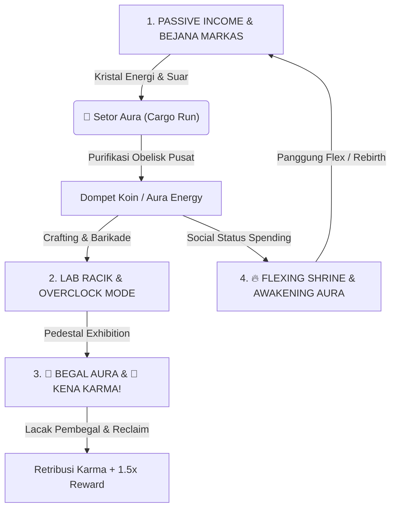
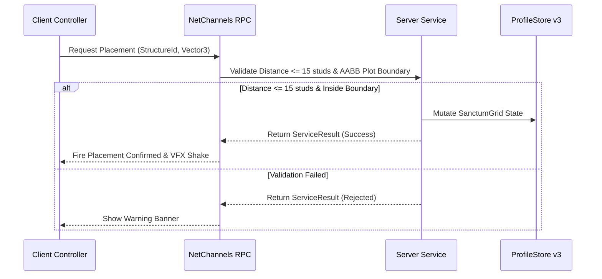
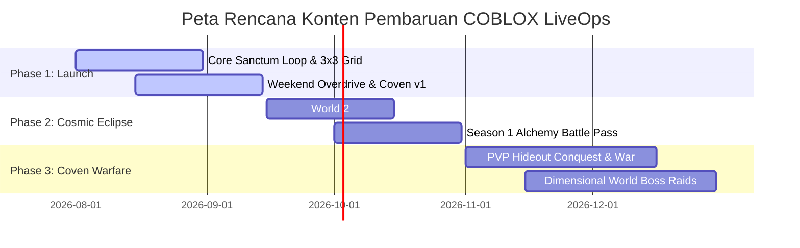

> **[🏠 Master Index](../../MASTER_INDEX.md) | [⬅️ Back to Docs](../../README.md)**

# 02 — MASTER GAME DESIGN DOCUMENT (GDD) & ARCHITECTURAL SPECIFICATION

---

# SECTION 1: VISION, MISSION & PRODUCT PHILOSOPHY

## 1. Vision Statement
Menjadikan **COBLOX: Multiverse Alchemy Sanctum** sebagai pengalaman *Hybrid Pet Tycoon & Social Action Experience* terdepan, berkinerja tinggi (*zero-lag*), dan paling terpercaya di platform Roblox pada tahun 2026. COBLOX menghadirkan perpaduan unik antara pembangunan Sanctum otomatis, pengumpulan pet elemental, pertarungan PVE aksi, serta sistem perdagangan antar pemain yang aman (*Zero-Trust Escrow*).

## 2. Mission Statement
Membangun pengalaman Roblox bermodular tinggi dan berotoritas server (*Server-Authoritative*) yang dioptimalkan secara ekstrem untuk performa lintas platform (termasuk seluler dan perangkat berspesifikasi rendah), didukung oleh alur kerja pengembang berbasis AI (*Agentic Coding System*) dan batasan domain yang tegas.

## 3. Core Values & Product Philosophy
- **Player Empowerment First:** Menghargai waktu pemain melalui progres yang bermakna, tingkat drop yang adil, serta antarmuka dwibahasa (*Indonesian-First & Global-Ready*) tanpa penyerapan iklan/popup yang mengganggu (*Zero Intrusive Popups*).
- **Zero-Trust Security & Idempotency:** Menjamin 100% keamanan aset dan mata uang dari upaya eksploitasi dan duplikasi item melalui validasi jarak fisik ($\le 15$ studs), AABB boundary checks, dan *Idempotent Marketplace Processing*.
- **Technical Excellence:** Mempertahankan anggaran performa ketat ($\le 20$ partikel aktif, memori $<6\text{ GB}$ RAM) untuk menjamin kelancaran permainan di semua perangkat.
- **Continuous LiveOps & Community:** Menyajikan konten segar secara berkala, sistem Ordo Alkemis (Coven), serta event LiveOps otomatis di akhir pekan.

## 4. Target Audience & Play Sessions
- **Target Audiens Utama (Platform Rating):** Usia 13+ (Menyesuaikan pedoman Roblox untuk kekerasan fantasi ringan pada Action Combat dan interaksi sosial/Trading).
- **Core Demographic (Hasil Survei/Sertifikasi):** Usia 16+ (Mekanisme ekonomi kompleks, *min-maxing* pertumbuhan Sanctum, dan manajemen Coven Guild lebih menarik bagi pemain remaja yang lebih dewasa).
- **Sesi Pendek Target (5–15 Menit):** Login harian (*Daily Streak*), klaim hasil tambang pet, dan penetasan cepat.
- **Sesi Panjang Target (30–90 Menit):** Penataan Sanctum Grid, pertarungan PVE & Ekspedisi Dimensi, donasi Coven Guild, serta perdagangan *Trade Escrow*.

---

# SECTION 2: BRAND BIBLE & VISUAL IDENTITY

## 1. Brand Positioning Matrix
- **Kategori:** Roblox Hybrid Pet Tycoon, Action Combat & Social Trading Experience.
- **Nilai Utama:** Progres pet yang mulus, *zero-lag*, berotoritas server, dan antarmuka dwibahasa (*Indonesian-First & Global-Ready*).
- **Arketipe Brand:** *The Innovator / The Playground* (Ceria, menguatkan, terpercaya, dan memukau secara visual).

## 2. Visual Language & Token Warna

| Token Name | Deskripsi Warna | HEX Code | Usage |
| :--- | :--- | :--- | :--- |
| `--brand-primary` | Royal Electric Purple | `#8A2BE2` | Tombol utama, header brand, Coven UI |
| `--brand-secondary` | Warm Radiance Amber | `#FFD700` | Tampilan mata uang, border Mythic, highlight Codex |
| `--brand-accent` | Emerald Triumph | `#50C878` | Konfirmasi sukses, konfirmasi Trade, penambangan pet |
| `--bg-dark-base` | Deep Space Charcoal | `#121214` | Latar belakang modal, HUD utama |
| `--bg-dark-surface` | Glassmorphic Surface | `#1E1E24` | Kontainer komponen, kartu inventory |

---

# SECTION 3: HIGH CONCEPT & MASTER GAMEPLAY LOOPS

## 1. High Concept
**COBLOX: Multiverse Alchemy Sanctum** adalah pengalaman *hybrid tycoon + pet collection + action combat* di mana pemain membangun Sanctum pabrik alkimia otomatis, mengumpulkan dan melatih *Spirit Pets*, mensintesis elemen magis di berbagai dimensi multiversal, serta bertarung melawan *Corrupted Elementals* demi meraih gelar **Arch-Alchemist**.

## 2. Master Gameplay Loops & Real Life Hyper-Reality Loop

### A. The Core Gameplay Loop (Real-Life Dynamics via Gen Z / Anime Hype Metaphor)
Siklus permainan COBLOX merefleksikan dinamika psikologi dunia nyata (bisnis, sosial, risiko-imbalan, dan status) yang dibungkus dalam bahasa **Gen Z / Alpha Slang & Anime Vibe** yang seru, trendi, etis, dan menghibur (bebas dari glorifikasi kriminalitas):

1. **PASSIVE INCOME & SETOR AURA (Ekonomi & Investasi Pasif):** Dropper Alkimia mengumpulkan energi kristal murni di bejana Markas. Saat kapasitas penuh (50,000 Energy), suar aura neon memancar. Pemain mengangkut muatan kristal energi (efek beban: *WalkSpeed* -15%) menuju *Obelisk Pusat* untuk **🚚 Setor Aura** dan dicairkan jadi Koin bersih.
2. **CRAFT ALCHEMY & OVERCLOCK MODE (Manajemen Sumber Daya & Transmutation):** Pemain memutar modal energi untuk meracik ramuan di *Lab Racik* dan memasang jebakan pertahanan Markas. Meminum ramuan memicu efek instan magis (**⚡ Overclock Mode Speed 45 + Screen Shake**, atau **Mode Raksasa Scale 2.5x + 500% HP**).
3. **BEGAL AURA & KENA KARMA! (Dinamika Kompetisi & Hukum Karma):** Pemain dapat bersaing membegal aura dari pedestal pemain lain (**🥷 Begal Aura**). Pemain yang dibegal akan mengaktifkan sistem **🎯 Kena Karma!** otomatis. Korban menggunakan Kompas Pelacak di HUD untuk berburu pembegal ($\le 15$ studs), merebut kembali auranya, dan mengklaim **1.5x Retribusi Bonus**.
4. **FLEXING SHRINE & AWAKENING AURA (Psikologi Sosial & Pelarian Penat):** Pemain mengekspresikan kesuksesan sosial di **🔥 Flexing Shrine** panggung utama dengan memicu *Server Aura Rain*, *Sky Color Override 60s*, atau *Billboard Announcement*, memberikan hiburan pelarian dari penatnya realita sebelum melakukan Awakening Aura (Rebirth) dan Upgrade Markas.


    Combat --> Coven[Donate to Alchemist Coven Guild]
    Coven --> Rebirth[Sanctum Evolution & Rebirth Multipliers]
    Rebirth --> Loop[Repeat with Permanent Buffs & Higher Sanctum Tiers]
```

---

# SECTION 4: CORE GAMEPLAY MECHANICS & PILLARS

### 🔮 1. Sanctum Evolution & Modular Grid Placement
- **Sanctum Evolution:** Visual pulau bertransformasi seiring peningkatan level Rebirth:
  - *Rebirth < 5:* Crystal Cave (Slate).
  - *Rebirth 5 - 9:* Floating Island (Cobblestone + Cyan Glow).
  - *Rebirth 10+:* Cosmic Temple (ForceField + Nebula Dark Blue).
- **3x3 Modular Placement Engine:** Pemain menata posisi mesin, dropper, dan bejana alkimia secara akurat menggunakan *Raycasting Hologram Preview* dan matematika *grid snapping 3x3 studs*.

### ⚔️ 2. PVE Action Combat & Mob AI
- **Combat Mechanics:** *LMB Attack*, *Q Dash*, dan *Parry* (Window 0.3s).
- **Server Distance Validation:** Seluruh hit-register diaudit di server dengan batasan fisik $\le 15$ studs.
- **FSM Mob AI:** Monster memiliki fase *Windup* 1 detik (indikator zona merah) sebelum menyerang.

### 🐉 3. Active Pet Mining (Pet Sim 99 Vibe)
- **Auto-Mining Loop:** Pet aktif mencari *Crystal Node* terdekat dalam jarak 30 studs setiap 2 detik.
- **Tween Impact Visuals:** Pet meluncur dengan animasi benturan elastis (*Back Out easing*) dan mengeluarkan efek *Particle Trail Aura*.

### 🏰 4. Alchemist Covens (Guild System - Logarithmic Anti-Inflation Formula)
- **Coven Creation:** 10,000 Coins untuk mendirikan Ordo Alkemis.
- **Treasury & Leveling:** Donasi koin ke kas klan. Level dihitung dengan formula logaritmik: $\text{Level} = \max\left(1, \lfloor 5 \times \ln(\text{Treasury} / 5000) \rfloor\right)$.
- **Global Multiplier Buff:** Buff global anggota (%): $\text{Global Multiplier Buff} = 1 + \left(0.15 \times \ln(\text{Level} + 1)\right)$.

### 🎥 5. Cinematic FTUE & Narrative Codex System
- **Interactive Ice Wall FTUE:** `ContextActionService` membekukan pergerakan, memicu adegan sinematik Master Alchemist, dan mengharuskan lemparan *Pyro Potion*.
- **Spirit Memory Cutscenes:** Saat pet mengalami *Awakening*, layar meredup (*Vignette*) dan teks narasi *typewriter* muncul.
- **Multiverse Codex UI:** Arsip membaca naskah dan mendengarkan *Audio Logs* cerita (*Tape 01, Tape 02, Journal 01*).

### 🌐 6. Engine Lokalisasi Dwibahasa (Indonesian-First & Global-Ready)
- Deteksi otomatis `LocalizationService.RobloxLocaleId`.
- **Indonesian-First:** Bahasa Indonesia (`id-id`) aktif secara default untuk pemain Indonesia.
- **Global-Ready:** Bahasa Inggris (`en-us`) aktif untuk pemain internasional.

---

# SECTION 5: ECONOMY BIBLE & MONETIZATION STRATEGY

## 1. Currency Taxonomy & Sinks
- **Aura Energy (Coins - Soft Currency 1):** Dihasilkan dari Sanctum Grid, tambang pet, dan Rebirth. Digunakan untuk upgrade, penetasan telur, dan membuat Coven Guild (10k Coins).
- **ChronoSparks (Gems - Soft Currency 2):** Dihasilkan dari Quests, Daily Streaks, dan Ekspedisi Dimensi.
- **Rebirth Tokens:** Memberikan permanent $+10\%$ Aura Multiplier per token.
- **Coven Treasury Pool:** Koin yang didonasikan oleh anggota klan untuk menaikkan level Coven ($\text{Level} = \max\left(1, \lfloor 5 \times \ln(\text{Treasury} / 5000) \rfloor\right)$).
- **Robux (Hard Currency):** Digunakan untuk Developer Products (*Aura Energy Packs*) dan Gamepasses (*VIP Multiplier*, *Auto-Craft*).

## 2. Drop Rate Matrix & Pity System
- **Pity Counter:** Setiap 100 penetasan telur tanpa pet Legendary menjamin 1 pet Legendary.
- **Luck Multiplier Formula:** $\text{Effective Rate} = \text{Base Rate} \times (1 + \text{Luck Stat} + \text{GamePass Boost} + \text{Coven Buff})$.

## 3. Idempotent Monetization
- **Idempotency:** `MonetizationService.luau` mencatat `PurchaseId` dalam cache memori untuk menjamin tidak ada duplikasi pemberian saldo.

---

# SECTION 6: PLAYER KNOWLEDGE BASE & GAMEPLAY MANUAL

## 📜 1. Lore & Kisah Latar Belakang
Di pusat alam semesta multiversal, terdapat **Alchemy Sanctum** — sebuah sanctum kuno tempat energi murni yang disebut **Aura Energy** dan **ChronoSparks** bersatu. Para Master Alkemis berkumpul di sanctum ini untuk mensintesis elemen ajaib, menetaskan makhluk elemental (*Spirit Pets*), dan menjaga keseimbangan energi antar dimensi.

## 🎮 2. Panduan Fitur & Mekanik Utama
- **Sistem Pertarungan:** Gunakan Klik Kiri (*LMB*) untuk menebas, *Q* untuk menghindar (*Dash*), dan *F* untuk menangkis (*Parry* dengan window 0.3 detik).
- **Penambangan Pet Aktif:** Pet aktif meluncur ke kristal terdekat dalam radius 30 studs setiap 2 detik untuk menambang koin ekstra.
- **Ordo Alkemis (Guild System):** Buat Ordo dengan 10k Coins. Donasikan koin untuk menaikkan level klan dan klaim **+5% Buff Multiplier** per level.
- **Kodeks Multiverse:** Kumpulkan fragmen cerita (*Tape 01, Tape 02*) dan baca kembali arsip lore di UI Kodeks.
- **Pertumbuhan Offline:** Kristal aura mensintesis energi offline hingga 12 jam.
- **Rebirth:** Memberikan +1 Rebirth Token dan +10% Permanent Aura Multiplier.

---

# SECTION 7: UX BIBLE & GRAPHICS DATA DEFINITION (GDD)

## 1. UI Screen Flow & Navigation Hierarchy

```text
COBLOX_AlchemyHUD (Main ScreenGui)
├── TopBar (Aura Energy ⚡, ChronoSparks ✨, LiveOps Boost Indicator)
├── Collapsible SideDrawer (MaxWidth = 180px)
│   ├── Grid Sanctum (Placement Engine Toggle)
│   ├── Bejana Sintesis (Synthesis Vessel)
│   ├── Penetasan Spirit (Spirit Hatchery)
│   ├── Ordo Coven (Coven Guild Modal)
│   ├── Kodeks Multiverse (Lore Archive Reader)
│   ├── Pusat Tukar (Trade Escrow Modal)
│   ├── Rebirth (Sanctum Evolution Trigger)
│   └── Toko (Shop & DevProducts)
└── Quick Action HUD (Combat Skill Hotbar: Attack, Dash, Parry)
```

## 2. Dynamic Graphics Data Definition (UI Data Contracts)

### A. Coven Order Modal Data Contract
```json
{
  "covenId": "string",
  "covenName": "string",
  "level": "number",
  "treasuryCoins": "number",
  "globalMultiplierBuff": "number (percentage)",
  "members": ["number (userId)"]
}
```

### B. Trade Escrow Dual-Confirm Data Contract
```json
{
  "sessionState": "Selecting | Locked | CountingDown | Executed",
  "myOffers": [{ "id": "string", "itemType": "Pet | Material", "amount": "number" }],
  "partnerOffers": [{ "id": "string", "itemType": "Pet | Material", "amount": "number" }],
  "countdownRemaining": "number"
}
```

## 3. Accessibility & Haptic Feedback Standards
- **Touch Targets:** Ukuran tombol minimal $48\times 48\text{ dp}$ pada seluler.
- **Button Animation Engine:** Interaksi via `UIButtonAnimator.luau` (efek *Hover spring scaling*, *Click audio chime*, *UI Spark particle emitters*).
- **Contrast Ratio:** Standar rasio kontras 4.5:1 (Slate 900 `#0F172A` background dengan Quantum Gold `#F59E0B` & Spark Cyan `#06B6D4`).

---

# SECTION 8: ART DIRECTION & AUDIO BIBLE

## 1. Visual Style & Model Budgets
- **Estetika:** Low-Poly bersih dan cerah dengan efek gradien halus (*Quantum Indigo*, *Aura Gold*, *Spark Cyan*).
- **Anggaran Poligon:** Maksimal 2.500 segitiga (triangles) per MeshPart (Pet, Monster, atau Mesin Sanctum).
- **VFXEngine.luau:** Mengontrol `ColorCorrectionEffect`, `BlurEffect`, `BloomEffect`, dan `ScreenShake` saat sintesis alkimia.

## 2. Audio Bible & Spatial Sound
- **Sound Buses:** `Master/BGM` (Musik latar), `Master/SFX/UI` (Klik tombol), `Master/SFX/World` (Penetasan, tebasan pedang, *Parry*).
- **Typewriter Sync:** Suara narasi cerita (*Tape 01, Tape 02*) tersinkronisasi dengan efek *typewriter* pada `CodexController.luau`.

---

# SECTION 9: ENGINEERING ARCHITECTURE CONTRACT

## 1. Architectural Principles & Domain Boundaries
- **Client Controllers (`src/Client/Controllers/`):** Visual rendering, raycasting (`PlacementController`), animasi partikel & screen shake (`VFXEngine`), audio, dan penyajian UI dwibahasa (`LocalizationController`).
- **Server Services (`src/Server/Services/`):** Otoritas tunggal untuk dompet (`EconomyService`), validasi 3x3 placement (`PlacementService`), FSM Mob AI (`MobService`), hit-register combat ($\le 15$ studs), dan Coven (`CovenService`).

## 2. Remote Network & Data Schema Contract



## 3. Data Persistence & Resilience
- **ProfileStore v3 Session Locking:** `PlayerAdded` mengambil kunci sesi; `PlayerRemoving` / `BindToClose` melepas sesi secara tertib.
- **Exponential Backoff Retry:** `ProfileStoreAdapter` mencoba ulang hingga 5 kali dengan backoff $2^{attempt-1}$ jika terjadi pemadaman DataStore.
- **Schema Auto-Reconciliation:** Menjamin kunci profil baru terisi tanpa merusak data lama.

## 4. Performance & Memory Budgeting (< 2.5 GB RAM Target)
- **RAM Footprint:** $< 2.5\text{ GB}$ total pemakaian memori pada perangkat seluler (Low-End Mobile Certified).
- **Object Pooling:** Menggunakan `ObjectPool.luau` untuk *Mineral Drops*, *Pet Aura Particles*, dan *UI Spark Emitters*.
- **Particle Budget:** Maksimal 20 partikel aktif per emitter (Culling jarak > 80 studs).
- **Network Rate Limit:** Maksimal 20 RPC/detik per klien dengan payload size $< 2\text{ KB}$.

---

# SECTION 10: DEVELOPER KNOWLEDGE BASE & REPOSITORY CONTRACT

## 1. Structure Directory (`src/`)

```text
src/
├── Server/
│   ├── Services/               # 22 Bounded Context Services
│   │   ├── PlayerDataService.luau
│   │   ├── ProfileStoreAdapter.luau
│   │   ├── MonetizationService.luau
│   │   ├── PlacementService.luau
│   │   ├── CombatService.luau
│   │   ├── MobService.luau
│   │   ├── CovenService.luau
│   │   ├── StoryService.luau
│   │   ├── RetentionService.luau
│   │   ├── RemoteConfigService.luau
│   │   ├── RemoteConfigRepository.luau
│   │   ├── LiveOpsService.luau
│   │   ├── AdminService.luau
│   │   ├── ExpeditionService.luau
│   │   ├── EconomyService.luau
│   │   ├── PetService.luau
│   │   ├── EggService.luau
│   │   └── StoreService.luau
│   │   └── LiveOpsProviders/
│   └── RuntimeServer.server.luau
├── Client/
│   ├── Controllers/            # 16 Client Controllers
│   │   ├── UIController.luau
│   │   ├── LocalizationController.luau
│   │   ├── CovenController.luau
│   │   ├── CodexController.luau
│   │   ├── PlacementController.luau
│   │   ├── CombatController.luau
│   │   ├── TradeController.luau
│   │   ├── TopbarController.luau
│   │   ├── AudioController.luau
│   │   └── PetRenderController.luau
│   ├── Modules/
│   │   └── UI/                 # UI Engines & Object Pools
│   │       ├── VFXEngine.luau
│   │       ├── UIAnimationEngine.luau
│   │       ├── UIEffectPool.luau
│   │       ├── UIButtonAnimator.luau
│   │       └── ReactiveState.luau
│   └── RuntimeClient.client.luau
├── Localization/
│   └── GameLocalization.luau   # Centralized id-id & en-us dictionary
└── Shared/
    ├── Configuration/
    ├── Constants/
    ├── Events/
    ├── Network/
    └── Utility/
```

## 2. Compilation & Verification Commands
- **Rojo Build:** `rojo build -o test.rbxl`
- **Rojo Serve:** `rojo serve`
- **Strict Typing Scan:** `python3 tools/repository_scan.py`

---

# SECTION 8: FINITE STATE MACHINE (FSM) MONSTER BEHAVIOR ARCHITECTURE

Sistem mengimplementasikan 5 kondisi (states) diskrit pada setiap entitas monster:
- **IDLE:** Karakter monster diam di titik spawn asli, melakukan pengecekan sensor radius (Proximity Check) setiap 0.5 detik terhadap karakter pemain terdekat.
- **CHASE:** Jika karakter pemain terdeteksi dalam radius 30 studs, entitas monster beralih mengejar pemain menggunakan metode interupsi jalur terpendek (`PathfindingService` jika ada rintangan, atau interpolasi `MoveTo` di area terbuka).
- **WINDUP (Fase Peringatan):** Saat jarak karakter pemain $\le 6$ studs, entitas monster berhenti bergerak selama 1.0 detik dan mengirim sinyal indikator zona merah (Visual Telegraph).
- **ATTACK (Eksekusi):** Server melakukan pengecekan instan (Hitbox Validation). Jika pemain masih di dalam zona merah, kurangi HP pemain dan mengembalikan kondisi secara otomatis (*auto-transition*) ke status **CHASE**.
- **RETURN:** Jika pemain keluar dari radius 45 studs (Leash Distance), entitas monster berjalan kembali ke titik spawn awal dengan kekebalan penuh (*Invulnerable*).

---

# SECTION 9: 3x3 MODULAR PLACEMENT ENGINE LOGIC

Proses penempatan menggunakan rumus pembulatan koordinat vektor terhadap kelipatan grid 3 studs:
$$\text{SnappedX} = \text{math.round}(\text{TargetX} / 3) \times 3$$
$$\text{SnappedZ} = \text{math.round}(\text{TargetZ} / 3) \times 3$$

Server memeriksa matriks 2D dan AABB Boundary Check sebelum menyimpan data ke ProfileService.

---

# SECTION 10: MONETIZATION & VALUE BALANCING MATRIX

- **Coins (Soft Currency):** Maksimum penambahan setoran adalah $5.000.000$ per transaksi setoran.
- **Batasan Transfer Trade Escrow (Anti-Inflation):**
  $$\text{Max Transfer} = (\text{Rebirth Pemain} + 1) \times 100.000 \text{ Coins/hari}$$

---

# SECTION 11: DATASTORE TRANSACTION LEDGER & SESSION LOCKING

## 1. Sistem Kunci Sesi (Session Locking) via ProfileService
- **Kunci Sesi Aktif:** Ketika karakter masuk ke Server A, Server A memberikan session lock pada dokumen database di cloud.
- **Penolakan Akses Ganda:** Server B menolak pemuatan data hingga Server A melepas tanda pengenal tersebut.
- **Pencegahan Korupsi Data:** Jika kunci sesi gagal didapatkan dalam waktu 15 detik, kick karakter dari permainan secara otomatis dengan pesan kesalahan: `"Gagal memuat profil. Silakan coba lagi nanti."`

## 2. Pencatatan Transaksi Hard Currency (Ledger Logging)
Setiap mutasi nilai pada Karma Gems / ChronoSparks wajib melewati pencatatan ganda (*Double-Entry Ledger*):
- **Format Log:** `[Waktu UTC, ID Transaksi Unik, Jumlah Perubahan, Saldo Akhir, Alasan Perubahan]`.
- **Verifikasi Sebelum Simpan:** Server melakukan kalkulasi ulang secara independen sebelum memperbarui nilai DataStore. Jika saldo akhir tidak cocok dengan rumus $[\text{Saldo Awal} + \text{Perubahan}]$, transaksi dibatalkan secara sepihak dan status akun ditandai untuk peninjauan admin (*Admin Flagged*).

---

# SECTION 12: STANDARD DIRECTORY STRUCTURE & SYSTEM BLUEPRINT

```text
[root]
 ├── default.project.json (Konfigurasi Sinkronisasi Studio / Rojo)
 ├── wally.toml (Manajemen Paket Eksternal)
 └── src
      ├── Server (Hanya Dapat Diakses & Dieksekusi oleh Server)
      │    ├── Services
      │    │    ├── PlayerDataService.luau (Manajemen ProfileStore & Ledger)
      │    │    ├── CrystalPurificationService.luau (Setor Aura Engine)
      │    │    └── MobService.luau (Pusat Kendali FSM Monster)
      │    └── RuntimeServer.server.luau (Titik Awal Eksekusi Server)
      │
      ├── Client (Hanya Dapat Diakses & Dieksekusi oleh Klien/HP/PC Pemain)
      │    ├── Controllers
      │    │    ├── UIController.luau (Manajemen Tampilan HUD & Menu)
      │    │    ├── CombatController.luau (Hitbox Lokal & Efek Visual)
      │    │    └── PlacementController.luau (Preview Hologram Snapping 3x3)
      │    └── RuntimeClient.client.luau (Titik Awal Eksekusi Klien)
      │
      └── Shared (Dapat Diakses Bersama oleh Server dan Klien)
           ├── Types
           │    └── DataTypes.luau (Definisi Strict Typing untuk Data Pemain)
           └── Network
                └── NetChannels.luau (Central Remote Binding)
```

Dengan ditambahkan bab-bab di atas, seluruh Master Game Design Document (GDD) & Architectural Specification untuk game COBLOX telah selesai dirancang.

---

# SECTION 13: LIVEOPS CONTENT ROADMAP & UPDATE CYCLE

Peta Rencana Konten Pembaruan (LiveOps Content Roadmap) dirancang untuk menjaga tingkat retensi pemain (D1 > 45%, D7 > 20%, D30 > 8%) dan menciptakan perputaran ekonomi yang sehat secara komersialisasi.

## 🗺️ 1. Fase Peluncuran & Pengembangan Konten (Phased Roadmap)



### 🚀 Phase 1: Global Commercial Launch (Bulan 1 - 2)
- **Core Loop**: Peluncuran Sanctum Grid 3x3, Spirit Pet Hatching, & Setor Aura Mechanics.
- **Coven System v1**: Ordo Alkemis, Kas Treasury Logaritmik, dan Hideout Sanctum Instanced.
- **Automated LiveOps**: Weekend Overdrive (Jumat 17:00 UTC) $+50\%$ Coins & Luck.

### 🌌 Phase 2: Cosmic Alchemical Eclipse (Bulan 3 - 4)
- **World 2 Expansion**: Dimensi Baru *Void Rift Realm* dengan elemen alkimia tingkat lanjut (*Void Crystals* & *Astral Essence*).
- **Shadow Raid 2.0**: Mekanik raid tim kooperatif untuk merebut Aura Node dari Boss Dimensi.
- **Season 1 Battle Pass**: *Alchemy Mastery Pass* berisi 50 Tier Skin Eksklusif, Pet Sparkle Trails, & Title Alkemis.

### ⚔️ Phase 3: Astral Coven Warfare & Cross-Dimension Raids (Bulan 5 - 6)
- **PVP Coven Conquest**: Perang antar-Coven memperebutkan *Multiverse Anchor Points* mingguan.
- **Pet Awakening 2.0**: Penggabungan 5 Pet Rare untuk membuka *Astral Divine Pet Form*.
- **Global Raid Boss**: World Boss berskala besar yang membutuhkan kolaborasi 30 pemain per server.

---

## 🔄 2. Ritme Pembaruan Otomatis (LiveOps Cadence)

| Frekuensi | Jenis Event / Pembaruan | Logika Eksekusi System |
|---|---|---|
| **Harian (24 Jam)** | Rotasi Toko Alkemis & Daily Quest Reset | Deterministic UNIX Seed: $\lfloor \text{UNIX} / 86400 \rfloor$ |
| **Mingguan (Akhir Pekan)** | Weekend Overdrive (+50% Rate Boost) | Multiplier Provider otomatis aktif Jumat 17:00 - Minggu 23:59 UTC |
| **Dua Mingguan (Bi-Weekly)** | Rotasi Flash Sale & Pet Banner Baru | RemoteConfig Live Update tanpa restart server |
| **Bulanan (Monthly)** | Season Battle Pass & Reset Leaderboard Coven | Sync otomatis via Cloud DataStore Ledger |
| **Triwulanan (Seasonal)** | Expansion World Baru & Major Update Feature | Rilis patch biner Rojo & update asset mesh |

---

Dengan Peta Rencana Konten Pembaruan (LiveOps Content Roadmap) ini, game COBLOX memiliki skenario keberlanjutan jangka panjang yang terstruktur, aman dari inflasi, dan siap menghibur pemain secara komersial!


