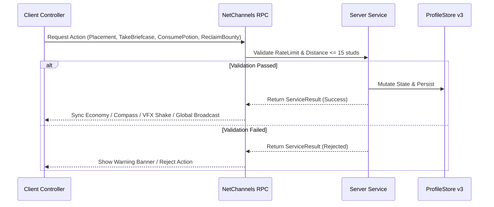

> **[🏠 Master Index](../MASTER_INDEX.md) | [⬅️ Back to Docs](../README.md)**

# 07 — ENGINEERING ARCHITECTURE CONTRACT

## 1. Architectural Principles & Domain Boundaries
COBLOX mengadopsi **Server-Authoritative Domain-Driven Architecture** dengan pemisahan tugas secara penuh (*Separation of Concerns*):

- **Client Controllers (`src/Client/Controllers/`):**
  - Bertanggung jawab atas visual rendering, raycasting kursor mouse (`PlacementController`), animasi partikel & screen shake (`MutationController`, `VFXEngine`), audio playback, kompas pelacak buronan (`KarmaContractController`), serta penyajian UI dwibahasa (`LocalizationController`).
  - Dilarang keras memodifikasi state dompet atau data pemain secara langsung tanpa RPC Server.
- **Server Services (`src/Server/Services/`):**
  - Otoritas tunggal untuk mutasi dompet (`EconomyService`), validasi grid placement 3x3 (`PlacementService`), akumulasi & purifikasi koin kristal (`CrystalPurificationService`), mutasi efek konsumsi ramuan (`ConsumableMutationService`), kontrak buronan pelacak & balas dendam (`KarmaContractService`), event sosial global (`FlexZoneService`), siklus FSM Mob AI (`MobService`), hit-register combat ($\le 15$ studs), dan manajemen klan (`CovenService`).
  - Mengelola *ProfileStore v3* resilience layer (`ProfileStoreAdapter`) dan transaksi *idempotent* (`MonetizationService`).

---

## 2. Remote Network & Data Schema Contract
Seluruh komunikasi antar *Client* dan *Server* melewati `NetChannels.luau` dengan kontrak data ketat:

---

## 3. Data Persistence & Resilience
- **ProfileStore v3 Session Locking:** `PlayerAdded` mengambil kunci sesi tunggal; `PlayerRemoving` / `BindToClose` melepas sesi secara tertib.
- **Exponential Backoff Retry:** `ProfileStoreAdapter` secara otomatis mencoba ulang hingga 5 kali dengan *backoff multiplier* $2^{attempt-1}$ jika terjadi pemadaman DataStore Roblox.
- **Schema Auto-Reconciliation:** Menjamin kunci profil baru (*UnlockedMemories*, *StoryFlags*, *CovenData*) terisi tanpa merusak data lama.

---

## 4. Performance & Memory Budgeting
- **RAM Footprint:** $< 6\text{ GB}$ total pemakaian memori pada perangkat seluler.
- **Object Pooling:** Menggunakan `ObjectPool.luau` untuk *Mineral Drops*, *Flex Coins*, *Pet Aura Particles*, dan *UI Spark Emitters*.
- **Network Rate Limit:** Maksimal 20 pemicuan RPC per detik per klien dengan batasan *payload size* $< 2\text{ KB}$.
