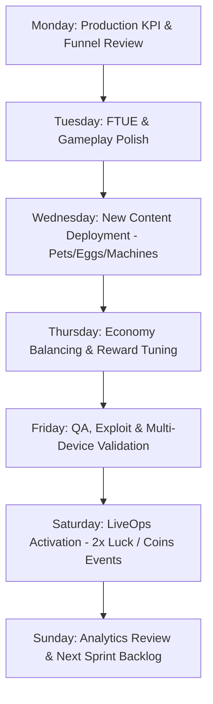
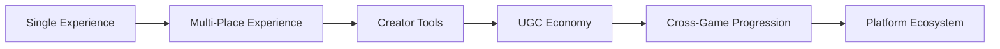

> **[🏠 Master Index](../MASTER_INDEX.md) | [⬅️ Back to Docs](../README.md)**

# 15 — ROADMAP & RELEASE MATRIX
**Version:** 6.1 (Continuous LiveOps & Weekly Cadence Edition — LGBOS v11.0)  
**Cross-References:** `docs/README.md`, `10-GTM/GTM.md`, `11-LIVEOPS_BIBLE/LIVEOPS.md`, `16-PRODUCTION_CHECKLIST/PRODUCTION_CHECKLIST.md`

---

## 1. Permanent Weekly Production Cadence

COBLOX operates under a strict recurring weekly operating rhythm:

---

## 2. Feature Milestones (LGBOS v11.0)

- **Sprint 1 (Completed):** DataStore Migration (ProfileStore v3), 60-second FTUE State Machine.
- **Sprint 2 (Completed):** Open Cloud CI/CD Pipeline Integration.
- **Sprint 3 (Upcoming):** Global Auction House (MemoryStoreService).
- **Sprint 4 (Upcoming):** Live Event System (MessagingService).

---

## 3. Scale Readiness Roadmap

When production metrics justify business growth, COBLOX expands along the canonical scale hierarchy:

---

## 4. Production KPI Target Dashboard

### Primary Business KPIs
- **Crash-Free Sessions:** $> 99.5\%$
- **FTUE Completion Rate:** $> 80\%$ (within 60 seconds)
- **First Egg Hatch:** $< 30\text{ seconds}$
- **Average Session Length:** $> 15\text{ minutes}$
- **D1 Retention:** $> 40\%$
- **D7 Retention:** $> 15\%$
- **D30 Retention:** $> 5\%$
- **First Purchase Conversion:** $> 2.5\%$
- **ARPDAU:** $> \$0.08$
