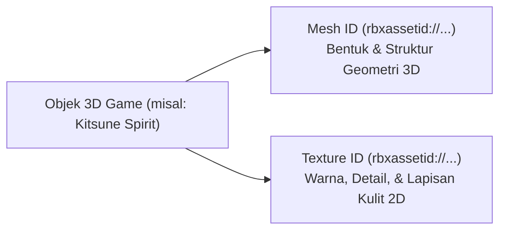

> **[🏠 Master Index](../../MASTER_INDEX.md) | [⬅️ Back to Docs](../../README.md)**

# 📖 Manual Setup & Content Injection Guide (LGBOS v11.0)

Panduan komprehensif mengenai alur kerja manual developer, injeksi konfigurasi aset (*Content Config Injection*), serta penjelasan teknis mengenai **Mesh ID** & **Texture ID** pada platform Roblox.

---

## 🛠️ 1. Hal-hal yang Harus Dilakukan Developer secara Manual

AI IDE Agent dapat mengolah 100% kodingan backend, alur logika server, rumus matematika, dan alur pergerakan UI/fisika. Namun, terdapat beberapa tindakan platform yang **wajib dilakukan secara manual oleh Developer** melalui Roblox Studio atau Roblox Creator Dashboard:

| Tindakan Manual | Alat / UI Roblox | Tujuan & Output |
|---|---|---|
| **Unggah Aset 3D/Audio** | Roblox Studio (`Asset Manager`) | Mengunggah berkas `.fbx`, `.obj`, `.png`, dan `.mp3` ke cloud Roblox untuk mendapatkan `rbxassetid://...` |
| **Injeksi Content Config** | Code Editor (`AssetManifest.luau` / `PetData.luau`) | Mengganti placeholder `rbxassetid://0` dengan ID publik aset yang telah diunggah |
| **Pendaftaran Monetisasi** | Roblox Creator Dashboard | Membuat Game Passes (VIP, Super Luck) & Dev Products untuk memperoleh ID Produk |
| **Penataan Peta 3D** | Roblox Studio Viewport | Menggeser posisi fisik *SpawnLocation*, *Plot Alchemy Sanctum*, atau *EggStands* di `workspace.Map` |
| **Publish Game** | Roblox Studio (`File -> Publish`) | Mempublikasikan tempat main (*Place*) ke server live Roblox |

---

## 💉 2. Apa itu "Injeksi Content Config"?

**Injeksi Content Config** adalah langkah pengisian ID Aset nyata yang diterbitkan oleh Roblox ke dalam skrip konfigurasi terpusat (`src/Assets/AssetManifest.luau`, `src/Shared/Configuration/PetData.luau`, `src/Shared/Configuration/RecipeConfig.luau`).

### Mekanisme Graceful Fallback (LGBOS v11.0)
Game COBLOX dilengkapi dengan sistem penanganan otomatis (`AssetRegistry.luau`):
- **Saat ID Masih `rbxassetid://0`**: Engine secara otomatis menggunakan model *Procedural Low-Poly Primitive* (Kubus, Tabung, atau Bola neon). Game **100% aman dan tidak akan bermasalah/crash**.
- **Setelah Injeksi Content Config**: Begitu Anda memasukkan ID asli (contoh: `rbxassetid://14029384751`), engine secara otomatis mengganti bentuk primitif dengan model 3D produksi yang estetik.

---

## 🧊 3. Definisi Mesh ID & Texture ID

Di platform Roblox, sebuah objek 3D terdiri dari dua komponen utama:

### A. Mesh ID (`rbxassetid://...`)
* **Definisi**: Berkas geometri 3D (*polygon mesh*) yang menentukan titik-titik bentuk fisik objek di dalam ruang 3D.
* **Fungsi**: Menentukan **wujud fisik 3D** (apakah objek berbentuk naga, kapsul hologram, atau reaktor lab).
* **Analoginya**: Bentuk patung polos dari tanah liat sebelum diberi warna.

### B. Texture ID (`rbxassetid://...`)
* **Definisi**: Berkas gambar 2D (*UV texture map*) yang dibungkuskan tepat di atas permukaan Mesh 3D.
* **Fungsi**: Menentukan **detail warna, pola garis, efek kilau, atau tulisan** di atas permukaan model.
* **Analoginya**: Cat lukis dan stiker warna-warni yang dilapisi di atas patung tanah liat.

---

## 📝 4. Langkah-Langkah Praktis Injeksi Content Config

1. Buka project `COBLOX` di Roblox Studio.
2. Buka jendela **Asset Manager** (`View` $\to$ `Asset Manager`).
3. Klik tombol **Bulk Import**, lalu pilih berkas model 3D (`.fbx`/`.obj`) atau gambar (`.png`) Anda.
4. Setelah proses unggah selesai, klik kanan aset pada Asset Manager $\to$ pilih **Copy Asset ID**.
5. Buka berkas konfigurasi terkait di IDE:
   - [AssetManifest.luau](../../../src/Assets/AssetManifest.luau)
   - [PetData.luau](../../../src/Shared/Configuration/PetData.luau)
6. Ganti ID placeholder `rbxassetid://0` dengan ID yang di-copy.
7. Jalankan perintah `rojo build -o test.rbxl` untuk menyinkronkan perubahan ke tempat (*place*) Roblox Studio Anda.
