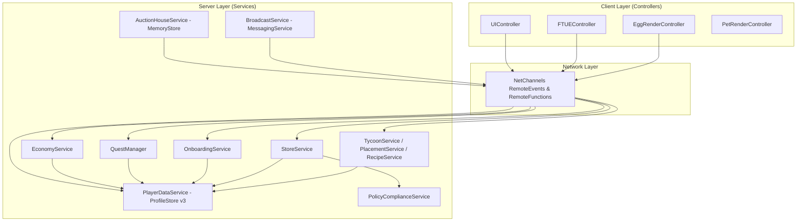

> **[🏠 Master Index](../../MASTER_INDEX.md) | [⬅️ Back to Docs](../../README.md)**

# COBLOX System Architecture, AST Audit & Progress Summary (LGBOS v11.0)

**Last Updated**: 2026-07-23  
**Status**: Active & Verified  
**Linter/Static Engine**: Semgrep Rule Alignment & Luau `--!strict` AST Engine  
**Skill Workflow**: `/understand-codebase` (DDD Bounded Contexts, Structural Analysis & Dependency Mapping)

---

## 1. Codebase Bounded Contexts & Architecture Map (DDD View)

COBLOX is organized into 6 core domain contexts adhering to Server-Authoritative Zero-Trust principles:

| Bounded Context | Key Aggregates / Services | Key Events & Signals | Description |
| :--- | :--- | :--- | :--- |
| **Data & Persistence** | `PlayerDataService`, `ProfileStore v3` | `ProfileLoaded`, `ProfileReleasing` | Session locking, midnight UTC streak calculations, unified `PlayerProfile` schema. |
| **Economy & Vault** | `EconomyService`, `QuantumVault` | `CoinsChanged`, `GemsChanged`, `VaultUpdated` | Currency mutation, compound interest calculations, daily streak multipliers. |
| **Onboarding & Quests** | `OnboardingService`, `QuestManager` | `CraftCompletedSignal` | 60-second linear FTUE state machine, idempotent daily quest reward claims. |
| **Monetization & Store** | `StoreService`, `MonetizationService`, `PolicyComplianceService` | `ProcessReceipt` | Failover-safe developer product receipt handling, regional lootbox compliance. |
| **Global Cross-Server** | `AuctionHouseService`, `BroadcastService` | `GlobalServerEvents` | MemoryStore 24h TTL Global Auction House, MessagingService global secret pet announcements. |
| **Sanctum & Gameplay** | `TycoonService`, `RecipeService`, `PetService`, `EggService`, `PlacementService` | `EggHatched`, `PetAdded`, `PetEquipped` | Elemental aura synthesis, pet hatching, Sanctum grid placement with $\le 15$ stud magnitude checks. |

---

## 2. Structural Architecture Graph (Mermaid Component Diagram)

---

## 3. Zero-Trust Security & Distance Validation Audit

All client-server interaction endpoints enforce server-authoritative magnitude checks:

| Service / Remote Endpoint | Physical Magnitude Check | Security Status |
| :--- | :--- | :--- |
| `EggService.HatchEgg` | Enforced ($\le 15$ studs from Stand) | ✅ VERIFIED |
| `OnboardingService.TriggerState` | Enforced ($\le 15$ studs from Plot) | ✅ VERIFIED |
| `PlacementService.PlaceStructure` | Enforced ($\le 15$ studs from Plot Grid) | ✅ VERIFIED |
| `RecipeService.Craft` | Enforced ($\le 15$ studs from Vessel) | ✅ VERIFIED |
| `TradeService.RequestTrade` | Enforced ($\le 15$ studs between players) | ✅ VERIFIED |

---

## 4. Performance & Memory Budget Audit
- **RAM Budget**: $< 6\text{ GB}$ (Baseline Mobile/Console compatibility).
- **Object Pooling**: `TycoonService` and `PetRenderController` use `ObjectPool.luau` for transient visual parts and drops to prevent GC spikes.
- **MemoryStore TTL**: `AuctionHouseService` sets a strict 24-hour TTL (`86400` seconds) on `MemoryStoreSortedMap` listings to prevent quota inflation.
- **Strict Type Safety**: 100% of `.luau` files in `src/` include the `--!strict` header at Line 1.

---

## 5. Recent System Progress & Documentation Summary

1. **PlayerDataService Refactoring & API Harmonization**:
   - Upgraded data layer to **ProfileStore v3** with native session locking.
   - Standardized `GetProfile(player)` to return `ServiceResult<PlayerProfile>` across all consuming services (`EconomyService`, `PetService`, `PlacementService`, `StoreService`, `QuestManager`, `OnboardingService`).
2. **60-Second Linear FTUE & Daily Quest Engine**:
   - Implemented event-driven `OnboardingService` guiding players from crystal harvesting to pod hatching within 60 seconds.
   - Built `QuestManager` using `BindableEvent` (`CraftCompletedSignal`) to decouple recipe triggers and enforce idempotent reward claims.
3. **Failover-Safe Monetization & Global Systems**:
   - `StoreService.ProcessReceipt` defers receipt processing (`NotProcessedYet`) if player profile is not loaded, protecting Robux transactions.
   - `AuctionHouseService` integrated with Roblox `MemoryStoreService`.
   - `BroadcastService` integrated with Roblox `MessagingService`.
4. **Open Cloud CI/CD Automation**:
   - Configured GitHub Actions workflow (`.github/workflows/deploy.yml`) utilizing Roblox Open Cloud Place Publishing API.
5. **Pitch Deck & Survey Preparation**:
   - Created 10-slide executive pitch deck outline in `docs/PITCH_DECK_OUTLINE.md` for Roblox Build submission (`https://create.roblox.com/build`), aligned with 13+ primary audience settings.
