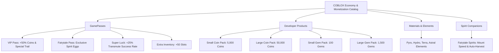

> **[🏠 Master Index](MASTER_INDEX.md) | [⬅️ Back to Docs](README.md)**

# 🎨 COBLOX Asset, Item, Monetization & DataStore Mapping Plan

Dokumen ini memetakan secara komprehensif **seluruh katalog aset 3D, gambar, produk ekonomi, item game, dan arsitektur DataStore** untuk **COBLOX: Multiverse Alchemy Sanctum**, serta pipeline otomatisasinya via Roblox Open Cloud API & Creator Store.

---

## 🏛️ 1. Matriks Sumber Daya & Aset (3D, Visual, Audio, & UI)

| Kategori Aset | Sumber & Channel | Spesifikasi Teknis | Integrasi Open Cloud / Pipeline |
| :--- | :--- | :--- | :--- |
| **Model 3D Meshes** | Synty Studio / Creator Store | Low-Poly Optimized Mesh, Single Texture Atlas (< 2.5 GB RAM) | Upload otomatis via Open Cloud `assets/v1/` (`Model` / `Mesh`) |
| **Tekstur & Decals** | Synty Atlas / DevForum | PBR/Diffuse Single Atlas (1024x1024) | Upload via Open Cloud `assets/v1/` (`Decal` / `Image`) |
| **VFX & Emitters** | Creator Store / Payhip | $\le 20$ active particles/emitter, `ObjectPool` recycling | Inject via Roblox Studio MCP / Rojo `src/Assets/VFX/` |
| **UI & Graphic Assets** | Payhip / Custom SVG | Glassmorphism, Modern Fonts (Inter/Outfit), 9-slice frames | Upload via Open Cloud `assets/v1/` (`Image`) |
| **Audio & SFX** | Creator Store Whitelisted | 4-channel `SoundPool`, Max distance culling | Upload via Open Cloud `assets/v1/` (`Audio`) |

---

## 💎 2. Katalog Produk Ekonomi & Item Game



---

## 🗄️ 3. Arsitektur Pemetaan DataStore & Persistence Schema

### 1. Main ProfileStore DataStore (`COBLOX_DataStore_LGBOS_v11`)
Key Schema: `Player_{UserId}`
```json
{
  "Coins": 15000,
  "Gems": 250,
  "AuraEnergy": 1200,
  "SanctumGrid": [
    { "SlotIndex": 1, "MachineId": "Extractor_Tier3", "Level": 5 },
    { "SlotIndex": 5, "MachineId": "Altar_Pyro", "Level": 2 }
  ],
  "Inventory": {
    "Material_PyroShard": 45,
    "Material_HydroEssence": 12
  },
  "EquippedSpirits": ["Spirit_Fairytale_01"],
  "UnlockedBadges": ["Badge_FirstTransmutation", "Badge_MasterAlchemist"]
}
```

### 2. Config Snapshot DataStore (`COBLOX_RegistrySnapshots`)
Digunakan oleh Open Cloud API & Web Admin untuk memverifikasi versi *registry* aktif dan melakukan *rollback* cepat jika terjadi isu keseimbangan ekonomi.

### 3. Web Portal Sync DataStore (`____PS`)
Digunakan oleh Vercel Web Portal (`hycoblox.vercel.app`) untuk mengekstraksi papan peringkat (*leaderboard*) dan menampilkan profil publik pemain.

---

## ⚡ 4. Pipeline Otomatisasi Open Cloud API

1. **Asset Auto-Ingestion (`scripts/agent_cloud_ops.py`):**
   - AI Agent mengunggah aset baru via `assets/v1/` $\longrightarrow$ Menerima Asset ID $\longrightarrow$ Menulis otomatis ke `Shared/Config/GeneratedMaterialRegistry.luau`.
2. **Monetization Sync via Economy v2 API:**
   - Menghubungkan harga DevProduct & GamePass langsung dari Roblox Creator Cloud ke Web Portal secara *real-time*.
3. **DataStore Cloud Backup & Analytics:**
   - Penarikan snapshot DataStore harian via DataStore v2 API ke database Neon PostgreSQL.
