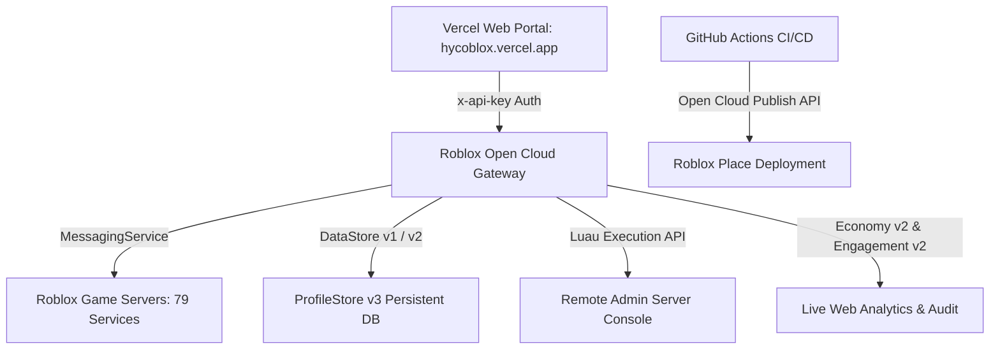

> **[🏠 Master Index](MASTER_INDEX.md) | [⬅️ Back to Docs](README.md)**

# 🌐 COBLOX Roblox Open Cloud API — Comprehensive Capability Matrix & Roadmap

Dokumen ini memetakan secara komprehensif seluruh potensi **Roblox Open Cloud API (16+ API Families)**, status kredensial aktif, integrasi MCP & Roblox Studio, serta peta jalan (*roadmap*) pemanfaatan fitur belum tergarap untuk **COBLOX: Multiverse Alchemy Sanctum**.

---

## 📜 1. Riwayat Sesi & Status Kredensial Terkonfirmasi

- **Identitas Key:** "COBLOX" (User ID: `11329819428`)
- **Universe & Place:** Universe ID `10545905192`, Place ID `105075159736246` ("COBLOX: Multiverse Alchemy Sanctum 🧪⚡")
- **Header Auth:** `x-api-key: <full-base64-jwt-key>`
- **IP CIDR:** `0.0.0.0/0` (Akses Publik Aktif untuk Vercel & CI/CD)
- **DataStores Ditemukan:** `COBLOX_DataStore_LGBOS_v11`, `COBLOX_RegistrySnapshots`, `____PS`
- **Uji Coba Endpoint Resmi (200 OK):**
  - `POST apis.roblox.com/api-keys/v1/introspect` $\longrightarrow$ **200 OK** (50+ Scopes)
  - `GET apis.roblox.com/cloud/v2/universes/10545905192` $\longrightarrow$ **200 OK**
  - `GET apis.roblox.com/cloud/v2/universes/10545905192/data-stores` $\longrightarrow$ **200 OK**

---

## 🏛️ 2. Pemetaan Arsitektur COBLOX vs Open Cloud

---

## ⚡ 3. Matriks Kemampuan 16+ Keluarga Roblox Open Cloud API

| Keluarga API | Endpoint utama | Status Scope | Potensi COBLOX Unlocked |
| :--- | :--- | :--- | :--- |
| **Luau Execution** | `luau-execution/v1/` | 🟢 Aktif | **POTENSI TERBESAR:** Eksekusi kode Luau arbitrary langsung di server Roblox dari Web Admin Panel (Live Hotfix/Server Maintenance). |
| **DataStore v2** | `cloud/v2/datastores/` | 🟢 Aktif | Manajemen data terstruktur, rollback versi otomatis, dan backup cloud tanpa merusak session lock ProfileStore. |
| **Economy v2** | `cloud/v2/economy/` | 🟢 Aktif | Audit real-time koin, robux payout, transaksi pasar pemain di Web Portal. |
| **Engagement v2** | `cloud/v2/engagement/` | 🟢 Aktif | Dashboard statistik pemain aktif (CCU), retensi, dan performa tempat secara *real-time*. |
| **MessagingService** | `messaging-service/v1/` | 🟢 Aktif | Push perubahan konfigurasi game real-time (`Config_Update`) dari Web Portal ke semua server Roblox. |
| **Assets v1** | `assets/v1/` | 🟢 Aktif | Otomatisasi pengunggahan tekstur, mesh 3D, dan audio dari CI/CD pipeline. |
| **Places/Universe v2**| `cloud/v2/universes/` | 🟢 Aktif | Pengelolaan versi tempat, publikasi otomatis pasca-build Rojo, dan pengaturan pengalaman. |
| **OAuth2** | `apis.roblox.com/oauth/` | 🟢 Aktif | Login via Roblox pada Web Portal `hycoblox.vercel.app`. |
| **User Restrictions** | `cloud/v2/.../user-restrictions` | 🟢 Aktif | Sistem Ban/Mute terpusat dari Web Admin Panel langsung ke DataModel Roblox. |

---

## 🎯 4. Rencana Tindak Lanjut & Peta Jalan (Roadmap)

1. **Implementasi Luau Remote Admin Console (Priority #1):**
   - Membuat API route `web/src/app/api/admin/exec-luau/route.ts` yang memanggil Open Cloud Luau Execution API untuk hotfix server live.
2. **Automated DataStore Backup Engine:**
   - Menjadwalkan backup harian DataStore `COBLOX_DataStore_LGBOS_v11` ke Neon PostgreSQL via Vercel Cron Jobs.
3. **Web Analytics & CCU Live Dashboard:**
   - Menampilkan statistik pemain real-time dari Engagement v2 API pada Web Portal Dashboard.
